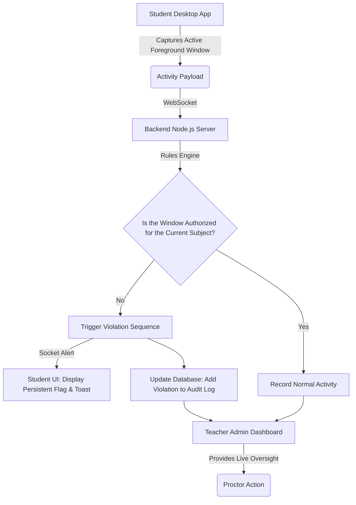

# Project Title: SmartLab Monitoring System

## Aim
To ensure academic integrity during lab sessions and exams by establishing a transparent, real-time monitoring environment that tracks application usage and provides immediate feedback on unauthorized activities.

## Objectives
- **Real-Time Monitoring:** Continuously track the active foreground windows on student machines using a lightweight desktop client.
- **Automated Rule Enforcement:** Dynamically evaluate student activity against permitted subjects and allowed applications.
- **Transparent Notifications:** Instantly alert students via persistent UI banners and toast notifications when an unauthorized window is detected.
- **Centralized Administration:** Provide teachers with a dashboard to oversee ongoing sessions, manage dynamic subjects, and review comprehensive student activity logs.

## Method & Flow Diagram
The operational architecture of the SmartLab Monitoring System is built upon a continuous, low-latency feedback loop between a specialized desktop client and a centralized backend server. 

### Core Operational Methodology
1. **Continuous Data Collection:** The student operates a desktop application (built with Electron and Node.js). It periodically captures the title and metadata of the currently active foreground window on the operating system.
2. **Real-Time Transmission:** Using a persistent WebSocket connection, the desktop client securely transmits this active window data, along with a unique student identifier, to the Node.js backend.
3. **Dynamic Rule Evaluation:** Upon receiving the data, the backend server processes it through its rules engine. The server dynamically fetches the allowed applications and URLs based on the subject the student is currently enrolled in.
4. **Immediate Action & Notification:** 
   - **Authorized Activity:** If the window is deemed acceptable, the server logs a "Normal" state. The teacher's dashboard updates silently.
   - **Unauthorized Activity:** If an unapproved application is detected, the server instantly triggers a violation. It sends a WebSocket alert back to the student's app, which renders a persistent warning banner and a toast notification explaining the violation. Simultaneously, the event is recorded in the permanent audit log and prominently displayed on the teacher's dashboard.

## Results & Deliverables
- **Student Desktop Client:** An application capable of discreet system monitoring and displaying immediate violation feedback.
- **Backend Infrastructure:** A robust Express.js/Socket.io server handling real-time connections, session state, and dynamic subject configurations.
- **Teacher Dashboard:** A web interface displaying active sessions, live system logs, and security audits for proctors.
- **Notification System:** A fully integrated alert system ensuring students know exactly why and when they were flagged.

## Conclusion
The SmartLab Monitoring System successfully mitigates academic dishonesty by combining real-time surveillance with immediate, transparent feedback. Rather than acting purely as a punitive tool, its instant notifications correct behavior on the spot, creating a fairer, more secure, and easily manageable proctored lab environment for educators and students alike.
